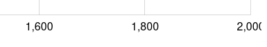
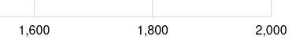
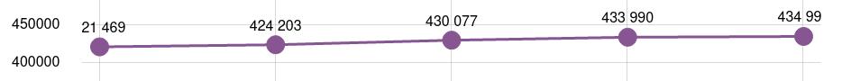
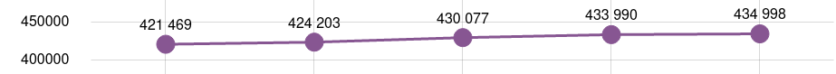

# Bugs

## Truncated label on X axis

If your last label is truncated on the X axis, try adding a margin to the right of your chart.

    chart.paddingRight = 30;

The problem:

The solution:

## Truncated labels within a graph

Try changing the values for <code>startLocation</code> and <code>endLocation</code>.

The problem:

    categoryAxis.startLocation = 0.4;
    categoryAxis.endLocation = 0.6;

The solution:

    categoryAxis.startLocation = 0;
    categoryAxis.endLocation = 1;

