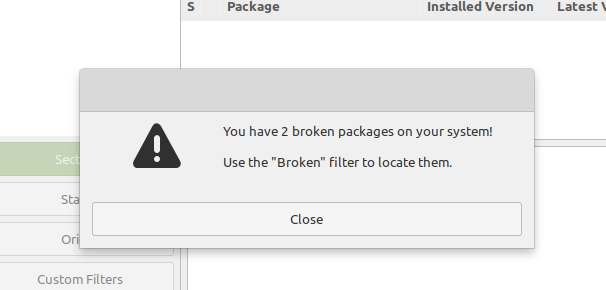

# Linux Mint Aide-Mémoire

## Broken Packages

If you run into a message regarding broken packages after updating software on Linux Mint, here is what you have to do:

1. Open Synaptic.
2. Click on the Edit tab.
3. Choose the Fix broken packages option.
4. Click on the Apply button.