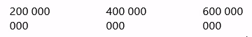

# A axis

The problem:

The solution:

You might want to use an empty space as a thousand separator in your X axis. This might produce a bug where these spaces wrap and high numbers end up on several lines. To avoid this, use both of these lines:

    chart.language.locale._thousandSeparator = ' ';
    valueAxis.numberFormatter.numberFormat = '#,##a';

## Truncated label on X axis

If your last label is truncated on the X axis, try adding a margin to the right of your chart.

    chart.paddingRight = 30;