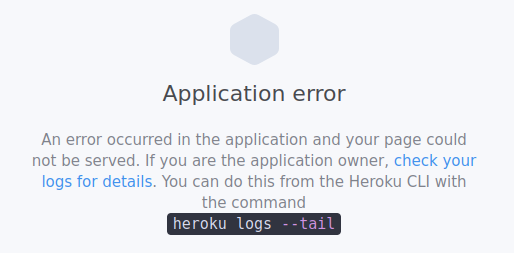

# Installing the Heroku CLI

1. Install snap ([documentation available on snapcraft](https://snapcraft.io/docs/installing-snap-on-linux-mint))

        sudo rm /etc/apt/preferences.d/nosnap.pref
        sudo apt update
        sudo apt install snapd

2. Install Heroku

        snap install --classic heroku

# Preparing your project for a deployment on Heroku

https://dev.to/anjolaogunmefun/deploy-vue-js-projects-to-heroku-1hb5

1. Go to the Terminal window and type this:

        npm install express serve-static

1. Generate a dist folder:

        npm run build

1. Create a server.js file in the root folder of your project.
1. Add [the code below](https://stackoverflow.com/questions/69321620/vuejs-3-project-cannot-get-message-with-all-paths-but-root) to server.js (because [Anjolaoluwa Ogunmefun's code](https://dev.to/anjolaogunmefun/deploy-vue-js-projects-to-heroku-1hb5) would of create a **Cannot Get / 404** bug on all non-root pages):

        const express = require('express');
        const serveStatic = require("serve-static")
        const path = require('path');
        app = express();
        app.use(serveStatic(path.join(__dirname, 'dist')));
        app.get(/.*/, function (req, res) {
            res.sendFile(__dirname + "/dist/index.html");
        });

        const port = process.env.PORT || 3000;
        app.listen(port);

1. Go to your package.json file and add this under the **script** part:

        ,
        "postinstall": "npm run build",
        "start": "node server.js"

# Creating a Heroku Project

1. Create a GitHub repository if you don't have one already.

1. Go to https://dashboard.heroku.com/apps.
1. Create a new project named this way: [my-web-app-name].
1. Go to the Terminal Window and make sure the app/project is initialized as a Git repository by typing:

        git status

1. On the Heroku web site, you can find more information about the name of your project under the **deploy** tab.
1. Set a Git remote:

        heroku git:remote -a [my-web-app-name]

1. Push your project to Heroku:

        git push heroku HEAD:master

1. On the Heroku's web site, click on **Open app**, which should be located somewhere in the top right corner of the page of your project

# Updating Your Project

Now all you have to do is to update your remote project and type:
    
    git push heroku HEAD:master

# Possible bugs

## Application error in Heroku

If you get this message while trying to load your site on Heroku, it might be because your package.json or /src/main.js changes are not pushed to Github or because your package.json file does not contain any reference to express (see above for how to install through CLI).

