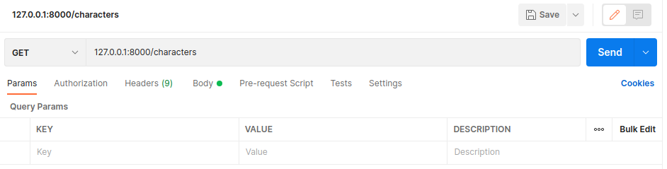

# Postman Aide-Mémoire

You do not have to create an account to use Postman locally.

For a concise tutorial on this topic (about 10 minutes), please refer to [The Basics of Using Postman for API Testing](https://www.youtube.com/watch?v=t5n07Ybz7yI) by Steve Griffith.

## Installing aide-mémoire

You can also download Postman from https://www.postman.com/, but the command below seems much easier.

    snap install postman

## Tabs in Postman

Some of the useful tabs in Postman are body, which allows you to make a POST request, and params, which allows you to specify parameters (although this might work as well if you pass parameters using the URL).