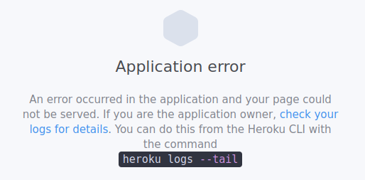

# vuejs-aide-memoire

Part of this aide-mémoire is inspired by content by [Dan Vega](https://www.udemy.com/course/vue-intro) and [Gwendolyn Faraday](https://www.youtube.com/watch?v=FXpIoQ_rT_c).

## Installing VueJS CLI

Run this command to install Vue CLI:

    sudo npm -g i @vue/cli

## Creating a VueJS project with the CLI

Run this command to create the project folder:

    vue create project-name

Or run this command to create the project in the current directory:

    vue create .

Select **Default (Vue 3)** and press Enter.

Run this command to run the project:

    npm run serve

## Installing and using BootStrap 5 in your project (optional)

    npm install --save bootstrap

- Go to main.js.
- Go to /src/main.js.
- Paste this line after all the other imports:

    import "bootstrap/dist/css/bootstrap.min.css";

## Installing vue-router in your project (optional)

The second command creates a simple menu with the Home and About pages in it. This might not be the case with the first command.

### Option 1

Via NPM:

    npm i vue-router@next

### Option 2

1. Install Via Vue CLI.

        vue add router

2. Answer yes when given this prompt:

        Use history mode for router? y

## Installing SASS in your project (optional)

    npm install -D sass-loader@^10 sass

## Using SASS in your project

Add this to a VueJS component:

    

### Installing the Heroku CLI

1. Install snap ([documentation available on snapcraft](https://snapcraft.io/docs/installing-snap-on-linux-mint))

        sudo rm /etc/apt/preferences.d/nosnap.pref
        sudo apt update
        sudo apt install snapd

2. Install Heroku

        snap install --classic heroku

### Preparing your project for a deployment on Heroku

https://dev.to/anjolaogunmefun/deploy-vue-js-projects-to-heroku-1hb5

1. Go to the Terminal window and type this:

        npm install express serve-static

1. Generate a dist folder:

        npm run build

1. Create a server.js file in the root folder of your project.
1. Add [the code below](https://stackoverflow.com/questions/69321620/vuejs-3-project-cannot-get-message-with-all-paths-but-root) to server.js (because [Anjolaoluwa Ogunmefun's code](https://dev.to/anjolaogunmefun/deploy-vue-js-projects-to-heroku-1hb5) would of create a **Cannot Get / 404** bug on all non-root pages):

        const express = require('express');
        const serveStatic = require("serve-static")
        const path = require('path');
        app = express();
        app.use(serveStatic(path.join(__dirname, 'dist')));
        app.get(/.*/, function (req, res) {
            res.sendFile(__dirname + "/dist/index.html");
        });

        const port = process.env.PORT || 3000;
        app.listen(port);

1. Go to your package.json file and add this under the **script** part:

        ,
        "postinstall": "npm run build",
        "start": "node server.js"

### Creating a Heroku Project

1. Create a GitHub repository if you don't have one already.

1. Go to https://dashboard.heroku.com/apps.
1. Create a new project named this way: [my-web-app-name].
1. Go to the Terminal Window and make sure the app/project is initialized as a Git repository by typing:

        git status

1. On the Heroku web site, you can find more information about the name of your project under the **deploy** tab.
1. Set a Git remote:

        heroku git:remote -a [my-web-app-name]

1. Push your project to Heroku:

        git push heroku HEAD:master

1. On the Heroku's web site, click on **Open app**, which should be located somewhere in the top right corner of the page of your project

### Updating Your Project

Now all you have to do is to update your remote project and type:
    
    git push heroku HEAD:master

## Barebone VueJS 3 with CDN

    <!DOCTYPE html>
    <html lang="en">
    <head>
        <meta charset="UTF-8">
        <meta http-equiv="X-UA-Compatible" content="IE=edge">
        <meta name="viewport" content="width=device-width, initial-scale=1.0">
        <title>Document</title>
    </head>
    <body>
        

            <h1>Simple JS injection</h1>
            
{{ greeting }}

        

        

        
        
    </body>
    </html>

## String Injection (binding a string with v-bind)

    

        
{{ greeting }}

    

    [...]

    

## Two-way data binding (v-model)

    

        

            
{{ greeting }}

            
<input v-model="greeting" />

        

    

    [...]

    

## v-if

    
v-if box

    [...]

    

## v-show

    
v-show box

    [...]

    

## v-if, v-else-if, v-else

    

        <h1>VueJS Directives</h1>
        <h3>v-if, v-else-if, v-else</h3>

        

        

        

    

    [...]

    

## v-cloak

With v-cloak, your content will show only when it's ready. 

    

    [...]

    

        <h1>My content</h1>
    

## Click event

- v-on:click="isVisible = true"
- @click="isVisible = true"

## Toggling

    

        <button v-on:click="isVisible = !isVisible">Toggle Box</button>

        

    

    [...]

    

or

    

        <button @click="toggle">Toggle</button>

        

    

    [...]

    

## Creating a method

    

        <button @click="addCount">Add to count</button>
    

    [...]

    

## Keyup event after pressing Enter

    

        <input type="text" @keyup.enter="greet(name)" v-model="name">
    

    [...]

    

## Right-click event

    

        <button @click.right="rightClick">Right-click event button</button>
    

    [...]

    

## Event modifiers

To prevent a submit event from reloading the page:

    

        <form @submit.prevent="handleSubmit">
            <input input="email">
            <input input="password">
            <button>Log in</button>
        </form>
    

    [...]

    

## Components

### Directly in your main VueJS file

You can create a new component within your main VueJS file.

    

        <component></component>
    

    [...]

    let app = Vue.createApp({
        data: function() {
            return {

            }
        }
    });

    app.component("my-component", {
        template: `
            

                component
            

        `
    });

### In a more modular way

1. Go to /src/components.
1. Create a new component file such as Component.vue.
1. It should look like this:

        <template>
            test
        </template>

        
        
1. Go to /src/views/Home.vue (assuming this is the name of the file where you want to import your component).
1. Create an instance of your component using the following syntax inside of your template:

        <Component />

1. Import and export your component between the <code>script</code> tags. It should look like this:

        

## Getting data from a form, version 1: email input and password input

    

        <form @submit.prevent="handleSubmit">
            <input input="email" v-model="email" >
            <input input="password" v-model="password" >
            <button>Log in</button>
        </form>
    

    [...]

    

## Getting data from a form, version 2: text input and password input also

The content below is from a [tutorial by Code Step By Step](https://www.youtube.com/watch?v=TyWBQ05J_R0).

Clicking on the Submit button logs to the console the content of the username and password fields.

    <template>
    

        <h1>This is an about page</h1>

        <form>
        

            <input type="text" v-model="myForm.username" placeholder="enter user name" />
        

        

            <input type="password" v-model="myForm.password" placeholder="enter user password" />
        

        <button type="submit" v-on:click="getForm">Submit</button>
        </form>

    

    </template>

    

## Props

    

        <example-props name="test 1"></example-props>
        <example-props name="test 2"></example-props>
    

    [...]

    app.component("example-props", {
        template: `<h3 class="center">{{ message }} {{this.name}}</h3>`,
        data() {
            return {
                message: "Example"
            }
        },
        props: ["name"],
        mounted() {
            console.log(`Example ${this.name} instance was mounted!`);
        }
    });

## Creating and using a dice component with a props

    

        <example-props num="4"></example-props>
        <example-props num="10"></example-props>
    

    [...]

    

## Looping through an object and rendering the data in it

    

        <ul>
            <li v-for="friend in friends" v-bind:key="friend.username">
                {{ friend.name }} | {{ friend.username }}
            </li>
        </ul>
    

    
    

## v-for

This code sample writes numbers from 1 to 10 in a bullet list.

    

        <ul>
            <li v-for="num in 10">{{ num }}</li>
        </ul>
    

## v-bind

Syntax:
- One way-binding, as opposed to view-model.
- **v-bind:** or **:**

## Life-cycle methods

    

        Showing how the lifecycle methods work.
    

    
    

## Working with an API

    

        <li v-for="item in response" v-bind:key="item.title">
            {{ item.title }}
        </li>
    

    [...]
    
    

## Using vue-router

### VueJS 2

User mdobydullah has created a [nice-looking, compact, CDN-only project](https://github.com/mdobydullah/vue.js-routing-using-cdn) on Github, thus allowing you to try out stuff without having to bother with a full-blown VueJS installation.

### VueJS 3

    <!DOCTYPE html>
    <html lang="en">
    <head>
        <meta charset="UTF-8">
        <meta http-equiv="X-UA-Compatible" content="IE=edge">
        <meta name="viewport" content="width=device-width, initial-scale=1.0">
        <title>Document</title>
    </head>
    <body>
        
        

        

            <h1>{{ mess }}</h1>

            <!-- i links -->
            <ul>
                <li><router-link to="/">Home</router-link></li>
                <li><router-link to="/about">About</router-link></li>
            </ul>

            <!-- contenitore per il HTML -->
            <router-view></router-view>
        

        
        

    </body>
    </html>

## Using the <code>slot</code> tag for default content

Please keep in mind that the <code>slot</code> tag is now deprecated. Ideally, you should use the v-slot directive instead.

    

        <buttbutt></buttbutt>
        <buttbutt>Custom</buttbutt>
    

    
    
    

## V-text

The v-text directive is just an alternative to the mustache syntax. Therefore, it is not necessary to use it if you already feel comfortable with mustache (brackets).

    

        

        
{{ myString }}

    

    
    
    

## V-html

As opposed to <code>v-text</code> and <code>{{ mustache }}</code>, <code>v-html</code> injects HTML instead of raw text.

    

        
{{ myString }}

        

    

    
    
    

## V-once

The v-once directive sets a string as static HTML.

    

        
{{ myString }}

        
{{ myString }}

        
<input type="text" v-model="myString">

    

    
    
    

## Conditionnally changing a class on an input field

    

    [...]

    

        <input v-model="myString" :class="[ myString.length < 2 ? 'red' : 'green'  ]">
    

    
    
    

## Avoiding props drilling in VueJS WITHOUT using Vuex

Source: https://www.youtube.com/watch?v=1oy8dn9xAQE

You can nest a whole bunch of components without having to drill the props. Instead you provide and inject your variables like so.

        let app = Vue.createApp({

        });

        app.component("component-x", {
            template: `
                
component x: {{ name }}
 
                <component-y></component-y>
            `,
            data() {
                return {
                    name: "J. Armitage"
                }
            },
            provide() {
                return {
                    username: this.name
                }

            }
        });

        app.component("component-y", {
            template: `
                <component-z></component-z>
            `
        });

        app.component("component-z", {
            template: `
                
component z: {{ username }}

            `,
            inject: ["username"]
        });

        app.mount("#app");

    </script>

## Passing an ID to the view

1. Install view-router if it's not included in your project already.
1. Go to src/router/index.js.
1. Create a route such as:

        path: '/about/:id'

1. Go to your view.
1. Make your view return something like this:

        export default ({
            data() {
                return {
                    id: 0
                }
            },
            mounted() {
                this.id = this.$route.params.id;
            }
        });

1. Use the curly brackets in your template to make it return the id:

        <template>
            

                <h1>This is an about page {{ id }}</h1>
            

        </template>

1. Remember that you have to use the new path (/:id) to view something in your browser.

## Another way of passing data to the view

        <template>
            

                <h1>This is an about page {{ this.$route.params.id }}</h1>
            

        </template>

## Creating Dynamic Routes

        <ul v-if="response.length > 0">
            <li v-for="(item, index) in response" v-bind:key="item.title">
                <router-link :to="`/about/${index + 1}`" :title="item.name">{{ item.name }}</router-link>
            </li>
        </ul>

## Changing a favicon

To change a favicon, all you have to do is find the default VueJS default favicon and replace it with a new one. The default favicon is located in two folders:

- dist/
- public/

## Adding a component to a project with import and export

A default HelloWorld component already exists in the project created with Vue CLI.

1. Go to components/.
1. Create a component like this:

        <template>
            

            <small>September 2021</small>
        </template>

        

1. Go to src/App.vue.
1. Import and export the new component like this:

        

## Running multiple fetch queries without having ugly code

This code sample is inspired by [material from www.pluralsight.com](https://www.pluralsight.com/guides/handling-nested-http-requests-using-the-fetch-api).

    

## Rerendering content with each click on links

Sometimes, you want to re-render a page, but content which is different. By default, this will create a strange behaviour when you click on the Backward and Forward buttons in your browser.

All you have to do is add a parameter to your view-router component.

1. Go to src/App.vue.
1. Find this line:

        <router-view />

1. Change it for this:

        <router-view :key="$route.fullPath" />

## Creating a 404 page

1. Go to src/views/.
1. Create a new component. You could name it PageNotFound.vue for instance.
1. The code in your component should look like this:

        <template>
            

                404 error. This page wasn't found!
            

        </template>

1. Go to src/router/index.js.
1. Import the PageNotFound component to the file:

        import PageNotFound from '../views/PageNotFound.vue'

1. Add this route in your routes array:

        { path: '/:PageNotFound(.*)*', name: 'PageNotFound', component: PageNotFound },

## Triggering a Bootstrap modal through JS

1. Go to /public/index.html
1. Add these lines to link Bootstrap to your project with a CDN:

        <link rel="stylesheet" href="https://cdn.jsdelivr.net/npm/bootstrap@5.1.1/dist/css/bootstrap.min.css">
        

1. Add this to your component:

        <!-- Modal -->
        

        

            

            

                <h5 class="modal-title" id="exampleModalLabel">Empty form</h5>
                <button type="button" class="btn-close" data-bs-dismiss="modal" aria-label="Close"></button>
            

            

                Make sure the input field is not empty before you click on Submit!
            

            

                <button type="button" class="btn btn-secondary" data-bs-dismiss="modal">Close</button>
            

            

        

        

        <!-- end modal -->

1. Still in your component, use something like this:

        handleSubmit() {
            const INPUT = document.querySelector("input").value;

            let modal = new window.bootstrap.Modal(document.getElementById('exampleModal'), {
            keyboard: false
            });

            // show Pokémon data
            if (INPUT.length > 0) {
            window.location.replace(`/about/${INPUT}`);
            // show empty field warning
            } else {
            console.log("show modal");
            modal.show();
            }

        },

1. The idea is to use <code>window.bootstrap</code> instead of just <code>bootstrap</code> when you create an instance of a Bootstrap modal. Creating an instance of a Bootstrap modal is a necessity if you want to control it via JS.

## Possible bugs

### Application error in Heroku

If you get this message while trying to load your site on Heroku, it might be because your package.json or /src/main.js changes are not pushed to Github or because your package.json file does not contain any reference to express (see above for how to install through CLI).

