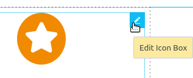
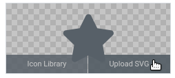

# Varia

## Adding shortcode in PHP/WordPress

	do_shortcode()

## Swapping Paragraphs And Image When On Mobile

	@media only screen and (max-width: 769px) {
		.swap-on-mobile {
			display: flex !important;
			flex-direction: column-reverse;
		}
	}

## No FTP Access: The Next Best Thing

"Forget using FTP or cPanel! Use our [wp file manager](https://filemanagerpro.io/) plugin to take full control of your Wordpress website."

## Rescanning A Site With WPML

Thanks to YB for this tip.

To rescan a site that has WPML in it, go to your dashboard, and find Localisation du thème et des plugins under WPML. Then do this:

## Clearing WPML Cache

- You can flush WPML cache in WPML > Support (Assistance techhnique) > Troubleshooting (Dépannage) > Clear the cache in WPML (Effacer le cache dans WPML) [https://wpml.org/forums/topic/wpml-cache-2/]

## Clearing WordPress Cache

This is either done with an FTP access or with a plug-in. WP Super Cache is a free plug-in.

With WP Super Cache:

1. Go to Settings.
1. Go to WP Super Cache.
1. Click on Delete Cache.

## Translation function with the WPML extension in WordPress

	<?= __('Demander une soumission', 'domain-name') ?>

## Translation without WPML in WordPress

	<?php if (ICL_LANGUAGE_CODE == "fr"): ?>
	
		<input name="NOM" type="text" placeholder="Prénom et nom" required>
		<input name="EMAIL" type="email" placeholder="Courriel" required>
		<button type="submit" class="button expanded">Je m'abonne</button>

	<?php else: ?>

		<input name="NOM" type="text" placeholder="First & last name" required>
		<input name="EMAIL" type="email" placeholder="Email" required>
		<button type="submit" class="button expanded">SIGN ME UP</button>

	<?php endif; ?>

## Creating A Sticky Menu With Elementor

If you have a top bar and a navigation menu on your site, the best is to make the navigaton menu sticky, but not the top bar. Otherwise the top bar and the navigation menu are going to overlap.

If you need to change the background color for your sticky menu, use this:

	.bdt-sticky-fixed {
		background-color: black;
	}

If you have just one bar that is not sticky, you can make it this way:

1. Select the whole section corresponding to the menu.
1. Go to the Advanced tab in the left-hand panel.
1. Go to the Motion Effects section.
1. Select "Top" next to "Sticky".

You can do this all in Elementor, no need to create special JS here.

## A Quick and Dirty Way of Injecting JS into WordPress

Thanks to [hmwebdev](https://github.com/hmwebdev) for this tip.

1. Go to functions.php
2. Create an add_action() function with two parameters
3. The first one is where you want to inject your code, for instance wp_head
4. The second one is where the name of your JS function
5. Mettre ta function JS tout simplement function nom() { ouvre une balise php et a l'intérieure de celle-ci une balise script html avec ton code js }

## Replacing an English Hard-Coded String and Translating it to Another Language

Thanks to [hmwebdev](https://github.com/hmwebdev) for this tip.

The extension I use for JS is **Simple Custom CSS and JS**.

1. Make sure the code is injected in your , not your header
2. Write something like:

	document.body.innerHTML = document.body.innerHTML.replace(/All Projects/g, 'Tous les projects');

## Dynamically Translating a Facebook Chat Plugin Depending on the Language of a Site

The procedure belows assumes the browser language looks like fr-FR or en-US and is not just a two-letter code.

1. Create a new line under **(function(d, s, id) {** and type:

		const currLang = document.documentElement.lang;
		const currLangLowDash = currLang.replace("-", "_")

2. Change the line that starts with **js.src** to this:

        js.src = `https://connect.facebook.net/${currLangLowDash}/sdk/xfbml.customerchat.js`;

3. Remove these lines or anything that ressembles them. This way, the logged-in and logged-out messages will vary depending on the language of the site instead of always staying the same.

        logged_in_greeting=“Bonjour, comment pouvons-nous vous aider? :parasol:”

        logged_out_greeting=“Bonjour, comment pouvons-nous vous aider? :parasol:“>

## Protecting forms

To access the administration for all the reCAPTCHAs you have created, go to https://www.google.com/recaptcha/admin/.

### Really Simple CAPTCHA (has not worked well for me so far)

Assuming you already have Contact Form 7 installed on your site, the steps are pretty straightforward:

1. Install the **Really Simple CAPTCHA** extension on your Web site.
2. Go to your pre-existing form where you want to add the CAPTCHA.
3. Add these shortcodes:

	[captchac captcha-1] [captchar captcha-1]

4. The team behind Contact Form 7 recommends reCAPTCHA instead of Really Simple CAPTCHA, but the latter seems to work just fine as of 2021-08-30.

### Contact Form 7 with no other extension

1. Go to Dashboard ===> Contact ===> Integration.
1. Under the reCAPTCHA title, go to Setup Integration.
1. In a new tab, go to https://www.google.com/recaptcha/admin/create.
1. Fill out the form (use reCAPTCHA v3).
1. Go back to the Setup Integration page.
1. Copy and paste the data from Google.
1. Hide the badge with this:

	.grecaptcha-badge { visibility: hidden; }

### WPForms with no other extension

Please keep in mind that with WPForms, you might not have a Google badge in the browser that confirms you sucessfully the CAPTCHA to your form.

1. Go to Dashboard ===> Contact ===> Integration.
1. Find the CAPTCHA tab and click on it.
1. Go to https://www.google.com/recaptcha/admin/create.
1. Fill out the form.
1. Go back to WordPress.
1. Copy and past the data from Google.

### Adding a honeypot to a form

1. Make sure Contact Form 7 is already installed in WordPress.
2. Install Honeypot for Contact Form 7.
3. If you want to change the default settings, go to the Dashboard ===> Contact ===> Honeypot.
4. To add a honeypot input field and block spam bots, go to your form and select the honeypot input field.

## Downloading a site

To download a site or part of it and browse to the folders, use the **WP File Manager** extension.

## Translating a slider created with Slider Revolution

[WPML allows you to translate revolution sliders without toil](https://wpml.org/documentation/plugins-compatibility/creating-multilingual-sliders-with-revolution-slider-and-wpml/).

## Testing out a Web site locally - Local by Flywheel

In my experience, the easiest way to run WordPress locally is with [Local by Flywheel](https://localwp.com/).

- Go to https://localwp.com/.
- Click the Download button.
- Fill out the form. Even though you are asked for an e-mail address, you won't have to use it at a later stage to confirm your identity. The file weights about 140 Mo.

## Sending mail with SMTP

Use WP Mail SMTP by wpforms for this. The icon is a silly-looking pigeon.

**Troubleshooting an undelivered mail issue**

1. Go to Dashboard ===> WP Mail SMTP ===> Settings.
1. There should be a red message telling you what's wrong.
1. The issue might just be re-granting a permission.
1. If so, the process is quick and easy.
1. You can also send test mails to make sure everything is working fine. There is an Email test tab for this.

## Ninja Form - Where to go to see mail sent through a form

1. Dashboard
1. Ninja Forms
1. Submissions
1. Select a form
1. Formulaire de contact

## Using custom icons in Elementor's icon widget

1. Edit the icon box.

	

1. Upload your SVG file.

	